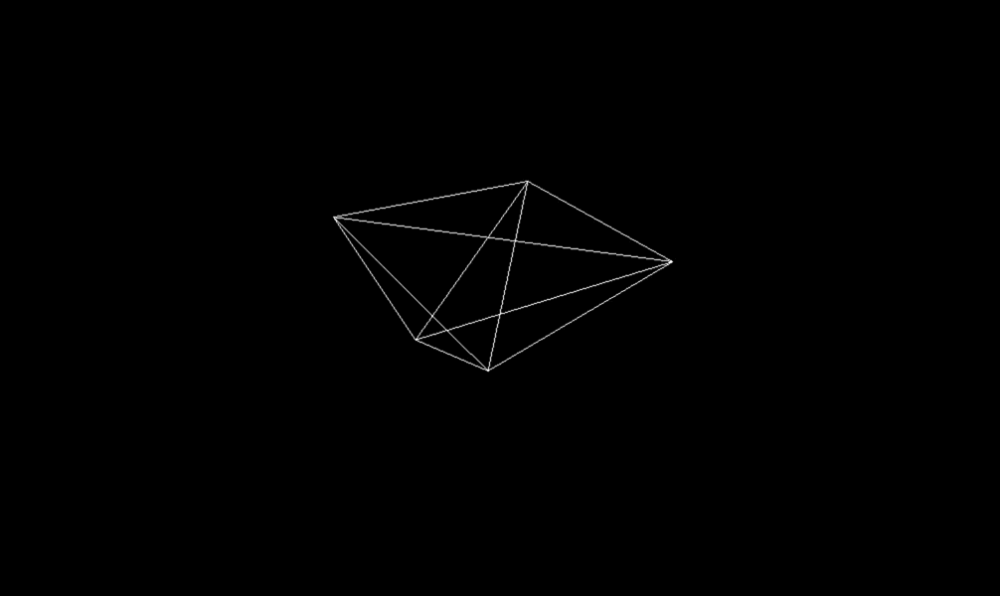

# threeJS
Just exploring with the threeJS library, which is made for elaborate and powerful graphics. Followed Sonar Systems set up tutorial and further played with different Geometric Shapes.

## Getting Started
Open the folder and double click on the index.html file! Its just a cone floating around :). 

